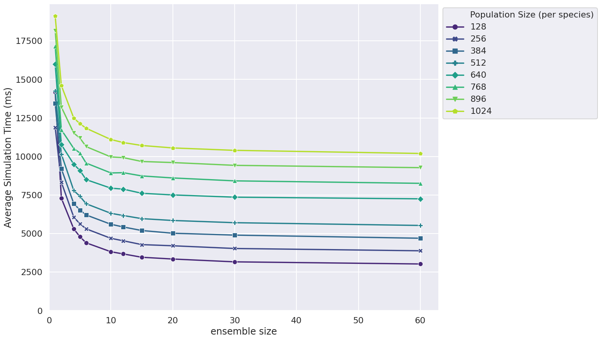
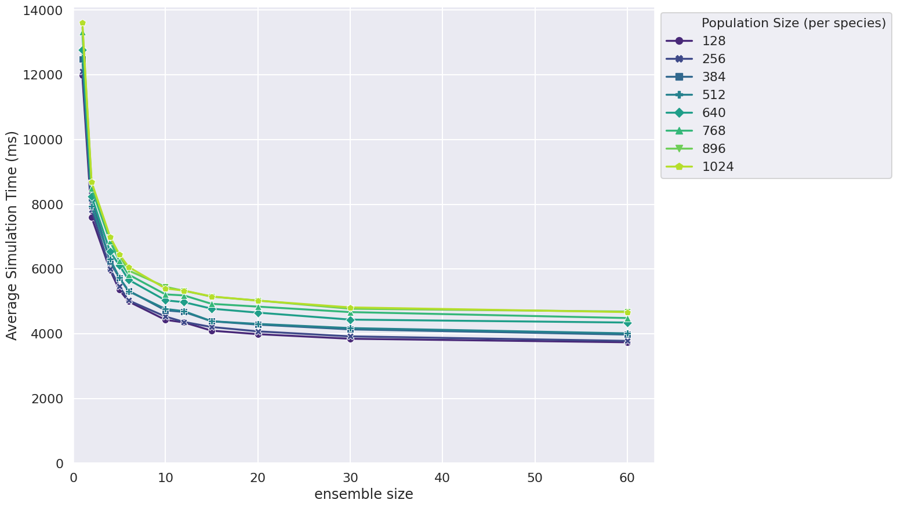
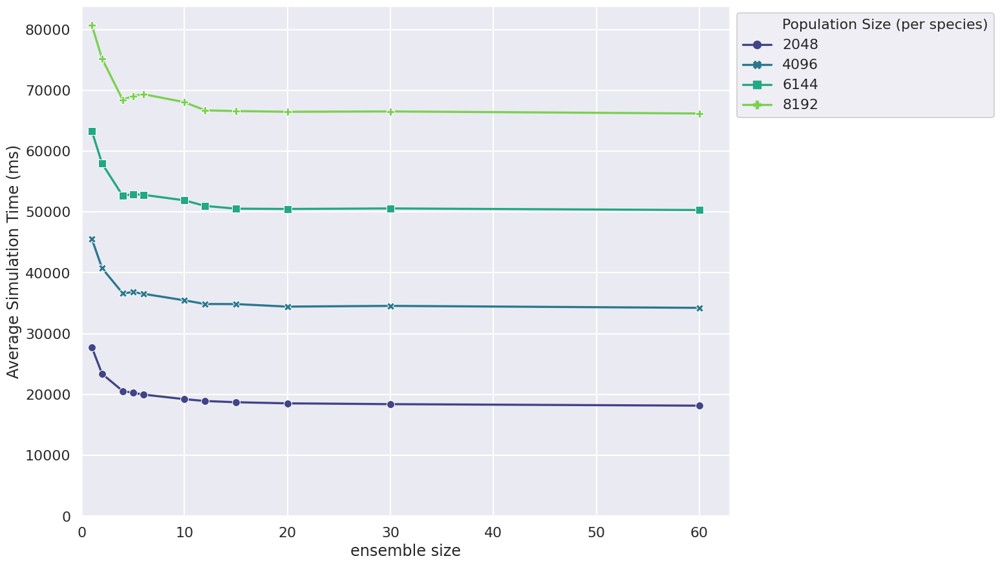
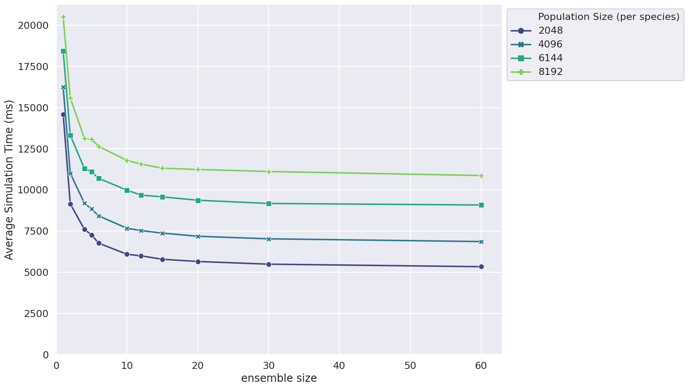

# FLAMEGPU2 Ensemble Experiments
This repository contains the Figures XYZ shown in the paper/talk [Link to talk/paper](), along with the code to generate them. The code demonstrates the effect and scaling of the concurrency feature of the FLAMEGPU2 agent-based modelling framework. Please note that generated figures may differ slightly as a result of the stochastic nature of the simulations and hardware differences.

# Figures

## Small Populations (Brute force)

*__Figure__ This figure shows ...*

Generated using an `NVIDIA V100` GPU.

## Small Populations (Spatial)

*__Figure__ This figure shows ...*

Generated using an `NVIDIA V100` GPU.

## Large Populations (Brute force)

*__Figure__ This figure shows ...*

Generated using an `NVIDIA V100` GPU.

## Large Populations (Spatial)

*__Figure__ This figure shows ...*

Generated using an `NVIDIA V100` GPU.

# Building the Experiments

[FLAMEGPU2](https://github.com/FLAMEGPU/FLAMEGPU2) is downloaded via CMake and configured as a dependency of the project.

## Dependencies

The dependencies below are required for building FLAME GPU 2.

### Required

* [CMake](https://cmake.org/) >= 3.12
  * CMake 3.16 is known to have issues on certain platforms
* [CUDA Toolkit](https://developer.nvidia.com/cuda-toolkit) >= 9.0
* [git](https://git-scm.com/): Required by CMake for downloading dependencies
* *Linux:*
  * [make](https://www.gnu.org/software/make/)
  * gcc/g++ >= 6 (version requirements [here](https://docs.nvidia.com/cuda/cuda-installation-guide-linux/index.html#system-requirements))
      * gcc/g++ >= 7 required for the test suite 
* *Windows:*
  * Visual Studio 2015 or higher (2019 preferred)


## Building FLAME GPU 2

FLAME GPU 2 uses [CMake](https://cmake.org/), as a cross-platform process, for configuring and generating build directives, e.g. `Makefile` or `.vcxproj`. This is used to build the FLAMEGPU2 library, examples, tests and documentation.

Below the core commands are provided, for the full guide refer to the main [FLAMEGPU2 guide](https://github.com/FLAMEGPU/FLAMEGPU2/blob/master/README.md).

### Linux

Under Linux, `cmake` can be used to generate makefiles specific to your system:

```
mkdir -p build && cd build
cmake .. 
make -j8
```

The option `-j8` enables parallel compilation using upto 8 threads, this is recommended to improve build times.

By default a `Makefile` for the `Release` build configuration will be generated. This is the configuration which was used to generate the results for the paper/talk.

### Windows

*Note: If installing CMake on Windows ensure CMake is added to the system path, allowing `cmake` to be used via `cmd`, this option is disabled within the installer by default.*

When generating Visual studio project files, using `cmake` (or `cmake-gui`), the platform **must** be specified as `x64`.

Using `cmake` this takes the form `-A x64`:

```
mkdir build && cd build
cmake .. -A x64
ALL_BUILD.sln
```

# Running the Experiments
By default all experiments are run and data will be generated to create all of the figures.

To run the experiments, run the generated binary file which will be found in `bin/{platform}/Release/`

# Generating Graphs

## Required
* [Python](https://www.python.org/downloads/) >= 3.0: Required for generating graphs

## Graph Generation
Run the command 
```
python3 graphs.py
``` 
from the `build` folder. This will generate the figures in the `figures` folder