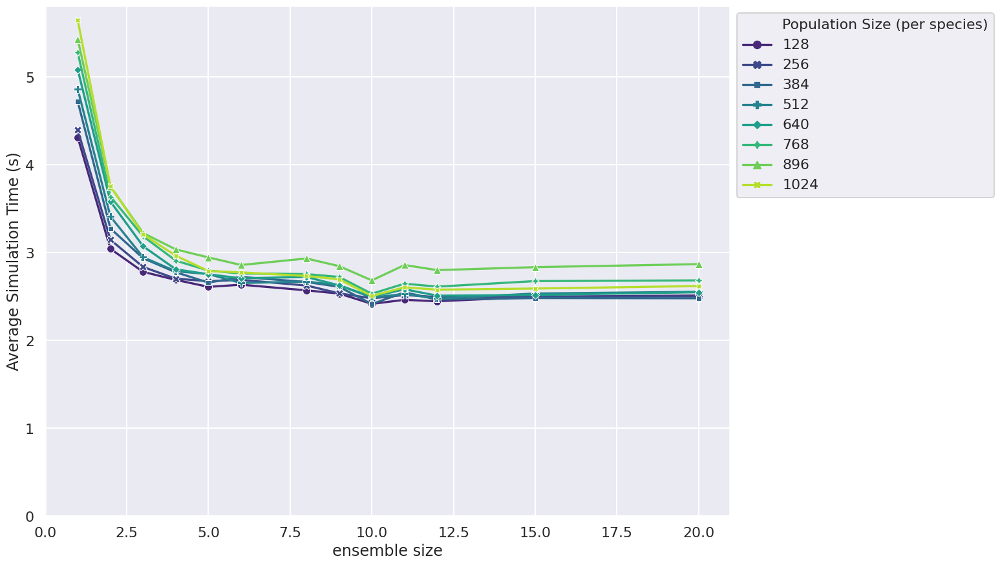

# FLAMEGPU2 Ensemble Benchmark

This repository contains performance benchmarking of a [FLAME GPU 2](https://github.com/FLAMEGPU/FLAMEGPU2) implementation of Boids agent based model running multiple concurrent simulations.

The code demonstrates the effect and scaling the number of concurrent simulation using the ensemble feature of the FLAMEGPU2 agent-based modelling framework.


## Benchmark Description and Results

A number of experiments are undertaken within this benchmark. There is a range of raw data in the [`sample/data`](sample/data) directory with a description of the machine configurations used to generate it in each directory.

The results below are from the V100 runs on the Bessemer HPC system at the University of Sheffield. Job submission scripts are included in the [`scripts/slurm`](`scripts/slurm`) folder.

### Small Populations (Brute force)

This figure shows how the average simulation time scales with ensemble size for different population sizes of a brute force messaging Boids model.

+ Population sizes are stepped between 128 and 1024 at intervals of 128
+ Simulation timing is measured over 500 steps


### Small Populations (Spatial)

This figure shows how the average simulation time scales with ensemble size for different population sizes of a spatial messaging Boids model.

+ Population sizes are stepped between 128 and 1024 at intervals of 128
+ Simulation timing is measured over 500 steps



### Large Populations (Brute force)

This figure shows how the average simulation time scales with ensemble size for different large population sizes of a brute force messaging Boids model.

+ Population sizes are stepped between 2048 and 8192 at intervals of 2048
+ Simulation timing is measured over 500 steps


### Large Populations (Spatial)

This figure shows how the average simulation time scales with ensemble size for different large population sizes of a spatial messaging Boids model.

+ Population sizes are stepped between 2048 and 8192 at intervals of 2048
+ Simulation timing is measured over 500 steps


## Building and Running the Benchmark

Detail of dependencies and the `cmake` build process are described in full in the [FLAMEGPU2-example-template Repo](https://github.com/FLAMEGPU/FLAMEGPU2-example-template) and are not repeated here. The benchmark should be built with seatbelts off (e.g. `-DSEATBELTS=OFF` passed to the `cmake` configuration step) to disable additional run-time checks and optionally disabling Python Swig support which is not needed for this model(-DBUILD_SWIG_PYTHON=OFF ). E.g. for Volta (`SM_70`) GPUs under Linux.

```bash
# Configure 
cmake . -B build -DCMAKE_BUILD_TYPE=Release -DSEATBELTS=OFF -DBUILD_SWIG_PYTHON=OFF -DCUDA_ARCH=70
# Build
cmake --build build -j`nproc` 
```

### Execution and Data generation

```bash
cd build
./bin/Release/circles-benchmarking 
```
This will produce a number of `.csv` files in the `build` directory.

Note: The `FLAMEGPU2_INC_DIR` environment variable may need to be set to `./_deps/flamegpu2-src/include/` for run-time compilation (RTC) to succeed if the source directory is not automatically found.

## Plotting Results

Figures can be generated from data in CSV files via a python script.

### Dependencies

It is recommended to use python virtual environment or conda environment for plotting dependencies.

I.e. for Linux to install the dependencies into a python3 virtual environment and plot the results from all experiments output to the `build` directory.

```bash
# From the root of the repository
# Create the venv
python3 -m venv .venv
# Activate the venv
source .venv/bin/activate
# Install the dependencies via pip
python3 -m pip install -Ur requirements.txt
# Plot using csv files contained within the build directory
python3 plot.py build -o build/figures
# Use -h / --help for more information on optional plotting script parameters.
```

The sample figures were generated from the root directory using

```bash
python3 plot.py sample/data/v100-470.82.01/alpha.2-v100-11.0-beltsoff -o sample/figures/v100-470.82.01/alpha.2-v100-11.0-beltsoff
```